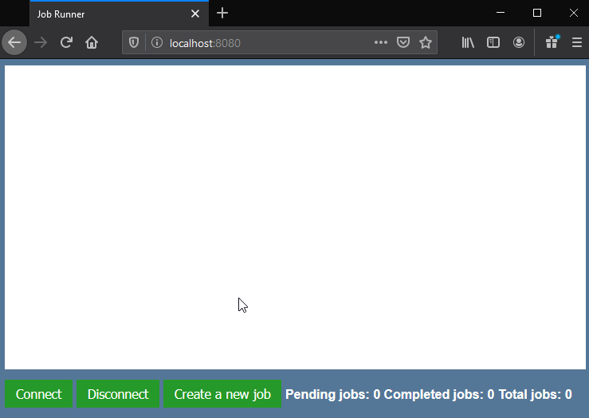

# go-websocket-job-runner

This is a proof of concept for a job runner service using the websocket api. Back-end is golang and uses [gorilla/websocket](github.com/gorilla/websocket) for websocket implementation. It serves static content in the `./static` directory and front-end is vanilla js/html/css. To run it, `go run main.go` then open your browser to localhost:8080.

## The Problem
Here are the parameters of the problem this repo is meant to solve conceptually:

- You have jobs running on a remote service.
- The jobs can sit in a queue for varying amounts of time and it's very difficult to estimate when they will complete.
- Users can queue jobs in parallel.
- Sometimes users want to queue a job in serial as a result of another job, so having timely information on when a job completes is important.
- The client can't rely on being online / available when a job completes, to recover from a power/network outage.

## How This Solution Works
Jobs are created via REST calls to `/createJob`. That route returns a UUID as the job ID. The jobs are monitored via websocket handler `/jobMonitor`. If you send a job ID to `/jobMonitor`, it does one of two things:

- If the job is already complete, sends the job ID back immediately indicating such.
- If the job is pending completion, adds that job ID to the list of job IDs this websocket client is monitoring. When any job your websocket client is monitoring completes, the API will send that job ID to the client to let it know.

So, in the case of surviving a power/network outage, you just pick up where you left off with the websocket handler (sending it any job IDs you want to monitor). If any jobs have completed while your power/network was down, the API will let you know when you request to watch that job ID's status.

## Demo
In this demo using the front-end, I simulate the client going offline by disconnecting the client from the websocket end point and then bringing it back online again:

